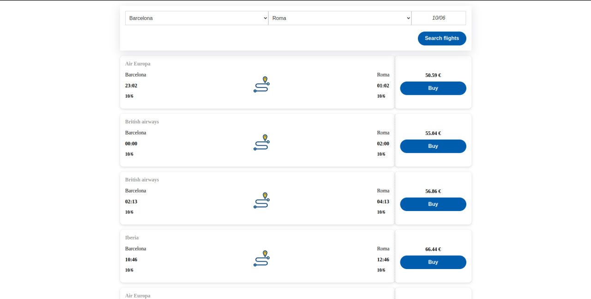

# eDreams Odigeo Frontend Challenge

This project consist on two different folder: the backend and the frontend one.



### Setup

1. Clone the repository:

   ```bash
   git clone https://github.com/turbolukoshko/edreams-clone.git
   ```

### Backend
> You should use Node 14.x

1. Navigate to the backend directory:

   ```bash
   cd backend
   ```

2. Install dependencies:

   ```bash
   npm install
   ```

3. Run backend:

   ```bash
   npm start
   ```

> The server listening on http://localhost:3000/

### Frontend

1. Navigate to the frontend directory:

   ```bash
   cd frontend
   ```

2. Install dependencies:

   ```bash
   npm install
   ```

3. Run project:
  ```bash
  npm run start
  ```

> The frontend will start on http://localhost:8080/

4. Run test:
  ```bash
  npm run test
  ```

### Backend notes

# Available services
* (GET) __/locations__ : retrieves the list of available locations.
    * http://localhost:3000/itineraries_
* (GET) __/itineraries__ : search flights for a given mandatory params
    * __departureLocation__: the city where you are searching flights from.
    * __arrivalLocation__: the city where you are searching flights to.
    * __departureYear__: the year which you are searching flights from.
    * __departureMonth__: the month which you are searching flights from.
    * __departureDay__: the day which you are searching flights from.


This is an example of a call to itineraries service.

http://localhost:3000/itineraries?departureLocation=Paris&arrivalLocation=London&departureYear=2022&departureMonth=04&departureDay=07